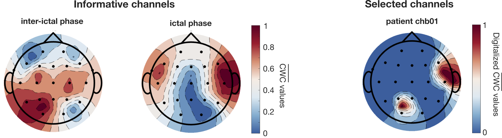

# Personalized seizure detection with two-selected EEG channels 
This repository contains the code related to the paper: Ferrara R., Giaquinto M., Percannella G., Rundo L., Saggese A. "Personalizing Seizure Detection to Individual Patients by an Optimal Selection of EEG Signals". Under review (Sensors).

This study proposes a lightweight Convolutional Neural Network tailored for personalized seizure detection. The model receives as input data from two EEG channels, selected through a data-driven approach that identifies the most informative channel during the ictal phase and another during the inter-ictal phase.

## Folder Structures

1. utils/: contains scripts for dataset processing, including EEG data extraction using the MNE package and segmentation into 1-hour records.

2. models/: contains the trained models for each patient. Note that we applied a leave-one-record-out strategy (on 1-hour records), so each patient has multiple folds.

3. test_folds/: contains the test record (in .npy format) and the corresponding label vector for each fold of every patient. The test records have been normalized using the mean and standard deviation values computed from the training set.

4. GT/: contains the ground truth .csv files for each patient. Each file provides, for all the patient's records, the class (presence or absence of epileptic seizures) and the corresponding seizure onset times, which are used to assess the detection delay relative to the actual seizure events.

## Run Experiments

python run_test.py 

